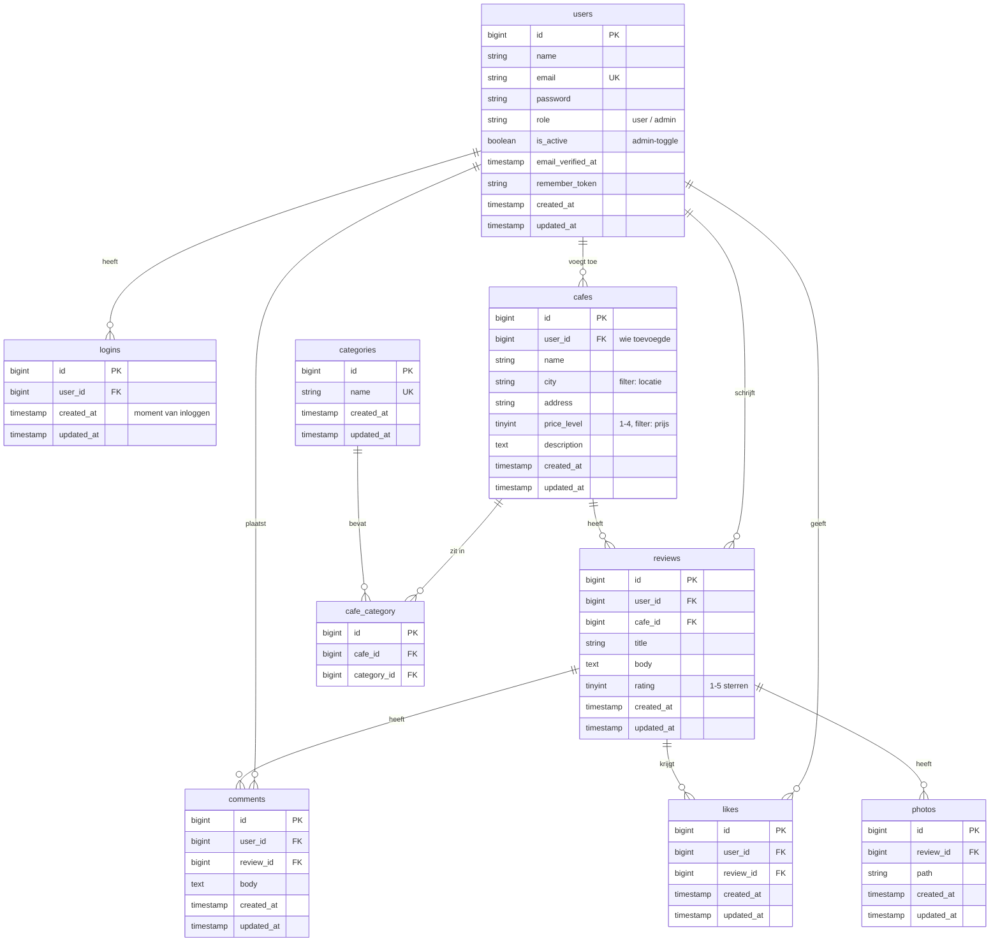

# Cafe Society – ERD

```mermaid
erDiagram
    users ||--o{ logins : "heeft"
    users ||--o{ cafes : "voegt toe"
    users ||--o{ reviews : "schrijft"
    users ||--o{ comments : "plaatst"
    users ||--o{ likes : "geeft"
    reviews ||--o{ likes : "krijgt"
    cafes ||--o{ reviews : "heeft"
    reviews ||--o{ comments : "heeft"
    reviews ||--o{ photos : "heeft"
    cafes ||--o{ cafe_category : "zit in"
    categories ||--o{ cafe_category : "bevat"

    users {
        bigint id PK
        string name
        string email UK
        string password
        string role "user / admin"
        boolean is_active "admin-toggle"
        timestamp email_verified_at
        string remember_token
        timestamp created_at
        timestamp updated_at
    }
    logins {
        bigint id PK
        bigint user_id FK
        timestamp created_at "moment van inloggen"
        timestamp updated_at
    }
    cafes {
        bigint id PK
        bigint user_id FK "wie toevoegde"
        string name
        string city "filter: locatie"
        string address
        tinyint price_level "1-4, filter: prijs"
        text description
        timestamp created_at
        timestamp updated_at
    }
    categories {
        bigint id PK
        string name UK
        timestamp created_at
        timestamp updated_at
    }
    cafe_category {
        bigint id PK
        bigint cafe_id FK
        bigint category_id FK
    }
    reviews {
        bigint id PK
        bigint user_id FK
        bigint cafe_id FK
        string title
        text body
        tinyint rating "1-5 sterren"
        timestamp created_at
        timestamp updated_at
    }
    photos {
        bigint id PK
        bigint review_id FK
        string path
        timestamp created_at
        timestamp updated_at
    }
    comments {
        bigint id PK
        bigint user_id FK
        bigint review_id FK
        text body
        timestamp created_at
        timestamp updated_at
    }
    likes {
        bigint id PK
        bigint user_id FK
        bigint review_id FK
        timestamp created_at
        timestamp updated_at
    }
```
